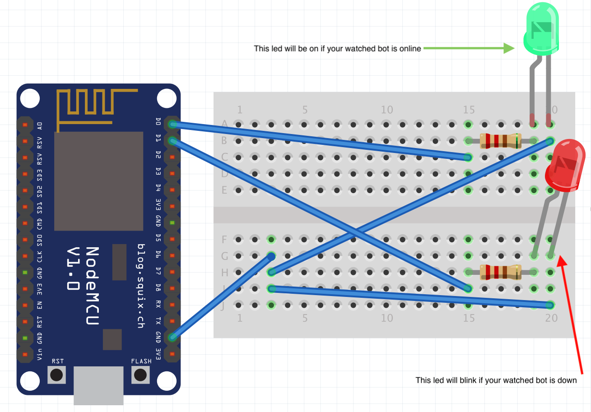

# Arduino, is my bot online?

It opens a websocket connection with Discord to receive `PRESENCE_UPDATE` events. Once the target become offline, it makes a red led blinks, and once it comes back online, it turns on the green led.

## How to install

* Set up your project using the schematic below.
* Download the code.
* Rename the `secrets_sample.h` file to `secrets.h` and fill it.
* Upload it to your Arduino.
* You're done!

Once the watched bot will be offline, the red led will blink.

## Used libraries

* [ArduinoJson](https://arduinojson.org/) (used to deserialize Discord payloads)
* [ArduinoWebsockets](https://github.com/gilmaimon/ArduinoWebsockets) (used to open a ws connection to Discord)

You will also need to add this link: `http://arduino.esp8266.com/stable/package_esp8266com_index.json` to the Additional boards Manager to be able to select `Node mcu 1.0` as the card type.

## Used components

* Arduino esp8266 mod (node mcu 1.0)
* Breadboard
* x2 color leds (one green, one red)
* x2 resistors (220 ohm)
* x5 wires

## Schematic

